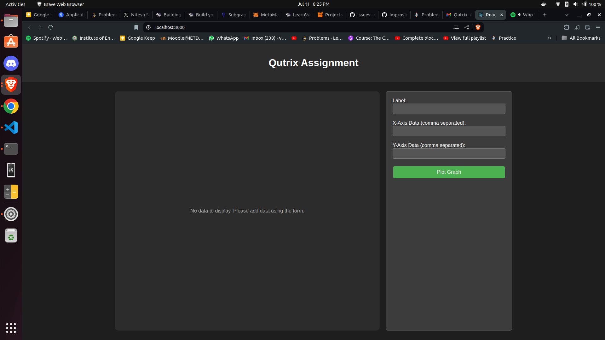
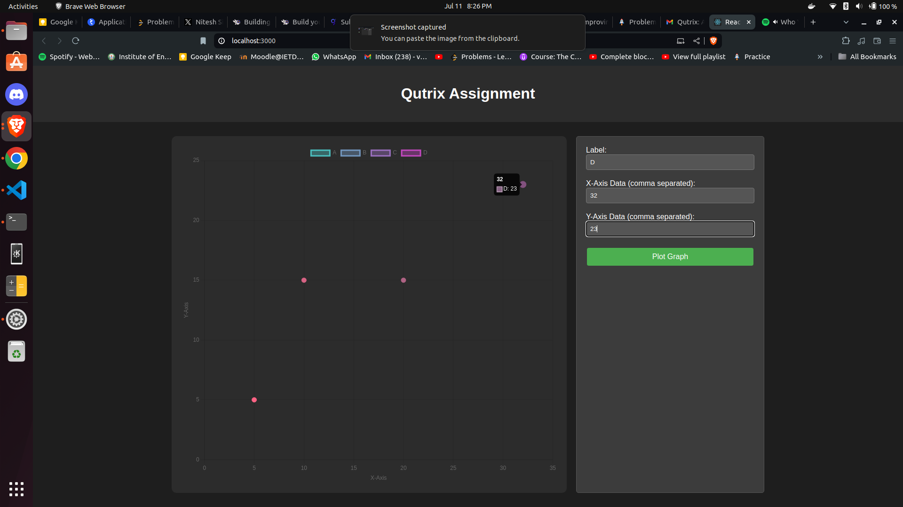

# 🚀 Graph Plotting Application

## 📌 Overview
This is a Graph Plotting application made using ReactJS where users can input data and visualize it in a graph format.

## Features
- Add new datasets with custom labels
- Input X-axis and Y-axis data
- View multiple datasets on a single graph
- Responsive and user-friendly dark mode UI
- Dynamic graph updates as new data is added

## Technologies Used
- ReactJS
- Chart.js
- HTML
- CSS

## Screenshots

